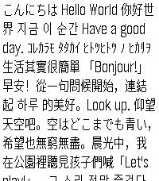
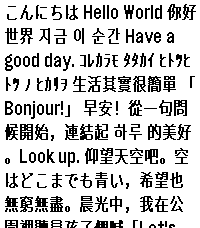
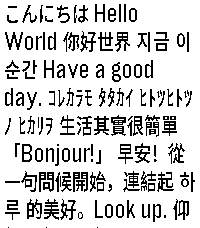
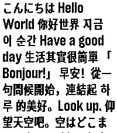
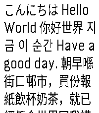
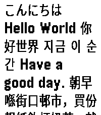

# Kyanite Bitmap Font 晶石点阵黑

This is a generated bitmap font based on [Sarasa Gothic](https://github.com/be5invis/Sarasa-Gothic). The font is generated with a narrower width to emulate a similar style to the PebbleOS's Gothic font. Due to the nature of less pixels being available, this font might not be as readable as other more blocky fonts in smaller size. But it should be mostly readable in context.

If you want a more blocky (also handcrafted and maybe more readable) font, check out [Tumbled Bitmap Font](https://github.com/TsFreddie/TUMBLED).

本字体是完全从 [Sarasa Gothic](https://github.com/be5invis/Sarasa-Gothic) 生成而来。生成时使用了稍窄的字符宽度模仿 PebbleOS 的 Gothic 压缩字体风格。由于整体横向像素就比较少，本字体的易读性可能不及其他方块像素字。但是在上下文中应该还算可读。

如果你更想要方块一些（并且是手工制作且可能更易读）的字体，推荐了解 [圆石点阵黑](https://github.com/TsFreddie/TUMBLED)。

## Download 下载

**[Download the latest release 下载最新版本](https://github.com/TsFreddie/KYANITE/releases/latest)**

### Packs 字体包

Each release ships the full packs plus reduced ones. Every pack fills the whole
resource layout the firmware expects; the reduced packs alias font variants that
the watch's notifications never use to an existing design of the same size, and
the pack format stores identical contents only once.

每次发布都会提供完整包和精简包。所有字体包都会填满固件所需的全部资源槽位；精简包会把通知中不会用到的字重指向同尺寸的现有设计，而字体包格式对相同的内容只存储一份。

| Pack                   | Watch         | Slots | Aliases                                        |
| ---------------------- | ------------- | ----- | ---------------------------------------------- |
| `KYANITE_P2D.pbl`      | Pebble 2 Duo  | 19    | none (KYANITE_14/18/24/28, regular and bold)   |
| `KYANITE_LITE_P2D.pbl` | Pebble 2 Duo  | 19    | `14_BOLD`→`14`, `24`→`24_BOLD`, `28_BOLD`→`28` |
| `KYANITE_PT2.pbl`      | Pebble Time 2 | 21    | none (adds KYANITE_36, regular and bold)       |
| `KYANITE_LITE_PT2.pbl` | Pebble Time 2 | 21    | `14_BOLD`→`14`, `36_BOLD`→`36`                 |
| `KYANITE_MINI_PT2.pbl` | Pebble Time 2 | 21    | LITE plus `18_BOLD`→`18`, only `Medium` uses   |

The aliases are chosen around notifications at the watch's default content size
(Pebble 2 Duo: `Medium`, Pebble Time 2: `Large`). Aliased slots still render
KYANITE glyphs, but show the referenced design: with `KYANITE_MINI_PT2`,
switching the watch to `Medium` or `ExtraLarge` makes notification headers and
titles use the regular weight.

精简包的别名是按手表默认字号下的通知来选择的（Pebble 2 Duo 为 `Medium`，Pebble Time 2 为 `Large`）。被指向的槽位依然会渲染 KYANITE 字形，只是显示所指设计：使用 `KYANITE_MINI_PT2` 时，如果把手表字号切换到 `Medium` 或 `ExtraLarge`，通知标题会改用常规字重。

## Preview

| Font Variant | Regular                                        | Bold                                                     |
| ------------ | ---------------------------------------------- | -------------------------------------------------------- |
| KYANITE_14   |  |  |
| KYANITE_18   |  |  |
| KYANITE_24   |  |  |
| KYANITE_28   |  |  |
| KYANITE_36   |  |  |

## Build

To build the fonts, [PebbleFontTool](https://github.com/TsFreddie/PebbleFontTool) is available as a separate repository.

```bash
# Clone the scripts
git clone https://github.com/TsFreddie/PebbleFontTool.git

# Setup the build environment
cd PebbleFontTool
bun install
cd..

# Run the build script (needs gettext for the pack metadata)
bun run ./build.js
```

## Licenses

This repository and packaged fonts are licensed under OFL 1.1.

## Acknowledgements

[Sarasa Gothic](https://github.com/be5invis/Sarasa-Gothic) ([OFL 1.1](https://github.com/be5invis/Sarasa-Gothic/blob/main/LICENSE) licensed) is used directly for generating this entire font.
